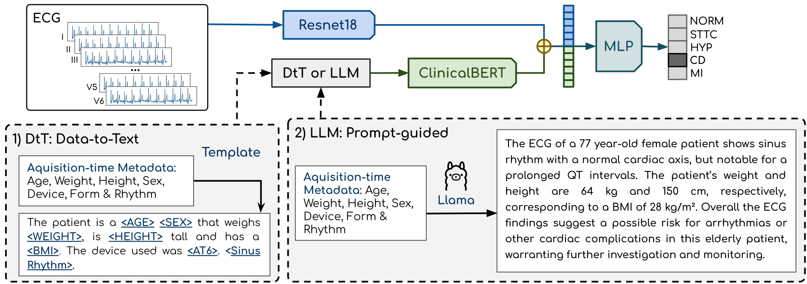

# CLIC: Contextual Language-Informed Cardiac pathology classification

This is the official implementation of our paper "[CLIC: Contextual Language-Informed Cardiac Pathology Classification](https://openreview.net/forum?id=9JVwoozhFo)" that was accepted @ [ICLR 2026 TSALM Workshop](https://tsalm-workshop.github.io/).

> Authors: Giovani D. Lucafó, Rafael da Costa Silva, João Lucas Luz Lima Sarcinelli, Andre Guarnier De Mitri and Diego Furtado Silva.


## Installation

To clone this repository:

```
git clone https://github.com/giovanidl/CLIC.git
```


## CLIC-LLM 

Illustration of the **C**ontextual **L**anguage-**I**nformed **C**ardiac pathology classification (CLIC) framework. The framework consists of two input data workflows: a Resnet18 that receives a 12-lead ECG as input, and a ClinicalBERT that receives a contextual clinical text generated via a template-based strategy called **Data-to-text** (1) and a **Prompt-guided** strategy that uses Llama (2).




### The prompt

Prompt used to train the Prompt-guided strategy (CLIC-LLM):

```
You are a cardiology specialist.

Generate a concise, single-paragraph clinical ECG report based on the information below.
Use formal medical English, objective tone, and clear clinical reasoning.

Patient information:
    

    Age: {age} years
    Sex: {sex}
    Weight: {weight} kg
    Height: {height} cm
    Body Mass Index: {bmi}
    Recording device: {collection_device}


Electrocardiographic findings:
    

    Signal morphology: {morphology_text}
    Cardiac rhythm: {rhythm_text}


End the report with a complete sentence and avoid bullet points or lists, and use all the information given above. 
Don't calculate the BMI yourself, always use the given BMI, just use the height and weight information if available.
Don't start the report with "Here is the clinical report" or similar phrases.
Don't ever provide information, such as 70 bpm heart rate, that is not given in the input. Only assumptions that can be made using the given input.
If the height is missing, it has a high chance of being above 40, according to the dataset paper, so it's safe to assume that the Body Mass Index of a patient with missing height data is above 40.
Don't include the unit of the Body Mass Index in the report, just say "has a BMI of 32", for example.
```

**Note:** Replace the `{var_name}` by the actual value.

### Dataset

Please download the [PTB-XL](https://www.physionet.org/content/ptb-xl/1.0.3/) dataset from physionet. 


