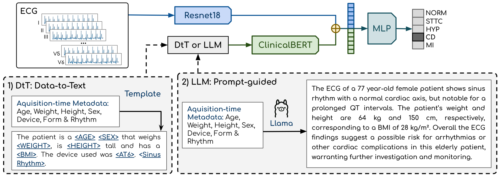

# CLIC: GENERALIZABLE CONTEXTUAL LANGUAGE-INFORMED CARDIAC PATHOLOGY CLASSIFICATION ACROSS ENCODERS AND FINETUNING STRATEGIES

This is the official implementation of our paper "CLIC: GENERALIZABLE CONTEXTUAL LANGUAGE-INFORMED CARDIAC
PATHOLOGY CLASSIFICATION ACROSS ENCODERS AND FINETUNING STRATEGIES"

> Authors: Giovani Decico Lucafó, Diego Furtado Silva

Institute of Mathematics and Computer Sciences (ICMC), 
University of São Paulo (USP)


## 1. Repository layout

```
prelim/
├── Model/
│   ├── model.py              # all model variants (ECG-only, ECG+Attr, CLIC-DtT/LLM, finetuning, MF, ...)
│   ├── ECG_encoder/          # ResNet18-1D backbone (trained from scratch)
│   └── BERT_pretrain/        # local HuggingFace cache for Bio_ClinicalBERT (auto-created)
├── ECGFounder/                # official ECGFounder repo (submodule-like, see §4.2)
│   └── 12_lead_ECGFounder.pth # pretrained foundation-model checkpoint (download separately)
├── utils/
│   ├── dataset.py             # PTBXLDataset (and the prompt-generation helper dataset)
│   ├── ecg_sources.py         # RawSignalSource / PrecomputedECGSource / CachedSignalSource
│   ├── text_sources.py        # RawTextSource / JSONTextSource / NPYTextSource
│   └── labels.py              # PTB-XL label map (NORM/MI/STTC/CD/HYP)
├── engine/                    # train/eval loops, forward adapters
├── experiments/                # ExperimentConfig + run_experiment runner
├── runs/
│   ├── resnet18/               # every experiment with ResNet18 as ECG encoder
│   └── ecgfounder/              # every experiment with ECGFounder as ECG encoder
├── generate_text_cache.py                  # builds the DtT / LLM text caches (.json)
├── generate_txt_embeddings.py              # encodes text caches with frozen ClinicalBERT (.npy)
├── precompute_ecg_embeddings.py            # encodes raw ECG with frozen ECGFounder (.npy)
├── precompute_ecgfounder_signal_cache.py   # pre-filters raw signal for ECGFounder finetuning
├── cache/
│   ├── json_cache/             # raw text caches (DtT, Llama, Qwen, Gemma, ATTR)
│   └── npy_cache/               # precomputed ECG/text embeddings
├── checkpoints/                 # one subfolder per experiment family, model .pt + per-run history
└── results/                     # one subfolder per experiment family, mean/std .csv per run
```

## 2. Environment setup

The project was developed with **Python 3.9 + CUDA 11.8**.
```bash
conda create -n clic python=3.9 -y
conda activate clic
conda install pytorch==2.x torchvision pytorch-cuda=11.8 -c pytorch -c nvidia
pip install transformers huggingface_hub wfdb pandas numpy scipy scikit-learn \
            tqdm ollama
```

- `transformers` / `huggingface_hub` → Bio_ClinicalBERT.
- `wfdb` → reading PTB-XL's WFDB-format signals.
- `ollama` (Python client) → talks to a local Ollama server to generate the
  LLM-based clinical reports (CLIC-LLM / CLIC-Qwen / CLIC-Gemma).


## 3. Download the data and external weights

### 3.1 PTB-XL dataset

Download PTB-XL (v1.0.3 recommended) from PhysioNet:

```bash
wget -r -N -c -np https://physionet.org/files/ptb-xl/1.0.3/ -P /path/to/PTBXL
```

The scripts expect the dataset **root** to directly contain `ptbxl_database.csv`,
`scp_statements.csv`, and the `records100/` / `records500/` folders (i.e. don't
nest it inside an extra `ptb-xl-1.0.3/` folder — flatten it if `wget` creates one).

Every script in `runs/`, plus `generate_text_cache.py`, hardcodes:

```python
DATA_DIR = "/home/giovanidl/Datasets/PTBXL"
```


## CLIC-Framework

Illustration of the CLIC framework. 




### The prompt

Prompt used to train the Prompt-guided strategy (CLIC-LLM):

```
You are a cardiology specialist.

Generate a concise, single-paragraph clinical ECG report based on the information below.
Use formal medical English, objective tone, and clear clinical reasoning.

Patient information:
    

    Age: {age} years
    Sex: {sex}
    Weight: {weight} kg
    Height: {height} cm
    Body Mass Index: {bmi}
    Recording device: {collection_device}


Electrocardiographic findings:
    

    Signal morphology: {morphology_text}
    Cardiac rhythm: {rhythm_text}


End the report with a complete sentence and avoid bullet points or lists, and use all the information given above. 
Don't calculate the BMI yourself, always use the given BMI, just use the height and weight information if available.
Don't start the report with "Here is the clinical report" or similar phrases.
Don't ever provide information, such as 70 bpm heart rate, that is not given in the input. Only assumptions that can be made using the given input.
If the height is missing, it has a high chance of being above 40, according to the dataset paper, so it's safe to assume that the Body Mass Index of a patient with missing height data is above 40.
Don't include the unit of the Body Mass Index in the report, just say "has a BMI of 32", for example.
```

**Note:** Replace the `{var_name}` by the actual value.

### 3.2 Bio_ClinicalBERT (text encoder)

No manual download needed — `transformers.BertModel.from_pretrained(...)` pulls
`emilyalsentzer/Bio_ClinicalBERT` from the HuggingFace Hub on first use and caches
it locally under `Model/BERT_pretrain/` (path is resolved relative to `Model/model.py`,
so it works regardless of your current working directory). Just make sure the
machine running training has internet access the first time, or pre-populate that
cache directory on an offline machine.

### 3.3 ECGFounder (pretrained ECG foundation model)

1. Clone the official ECGFounder repository into `prelim/ECGFounder/` (already
   vendored in this repo — `net1d.py`, `util.py`, etc. come from it).
2. Download the pretrained 12-lead checkpoint (`12_lead_ECGFounder.pth`) from the
   authors' release and place it at:

   ```
   prelim/ECGFounder/12_lead_ECGFounder.pth
   ```

   This exact path is hardcoded in `Model/model.py`
   (`MODEL_FM_RobustText_Finetuning._load_ecgfounder_backbone`) and in
   `precompute_ecg_embeddings.py`. The architecture is reconstructed manually
   (`Net1D` with `filter_list=[64,160,160,400,400,1024,1024]`,
   `m_blocks_list=[2,2,2,3,3,4,4]`, `n_classes=150`) to match the released
   checkpoint, so don't change those hyperparameters unless you also change the
   checkpoint.

### 3.4 LLM text generators (Ollama)

The LLM-generated clinical reports (CLIC-LLM, CLIC-Qwen, CLIC-Gemma) are produced
offline via a local [Ollama](https://ollama.com) server.

```bash
# install Ollama, then pull the three models used in the paper
ollama pull llama3.1:8b
ollama pull qwen3.5:9b
ollama pull gemma4:12b

# make sure the server is running before generating text caches
ollama serve
```

These are 6–8 GB (Qwen) / ~8 GB (Gemma) downloads each, and generation is done
with `think=False` and `temperature=0.0` for determinism (see
`generate_text_cache.py:generate_medical_text`).

## 4. Pipeline — order of execution

The full pipeline has four stages. Steps 1–3 only need to run **once** (their
outputs are cached to disk); step 4 is where you actually train/evaluate a given
CLIC configuration.

### Step 1 — Generate the text caches (`.json`)

`generate_text_cache.py` builds one JSON cache per split (`train`/`val`/`test`)
and per textual strategy, keyed by `filename_hr` (the ECG record id):

| Cache prefix | Strategy | How it's produced |
|---|---|---|
| `robust_text_cache_*` | **CLIC-DtT** (Data-to-Text) | deterministic template, `generate_robust_text_from_metadata` |
| `llm_text_cache_*` | **CLIC-LLM** | `llama3.1:8b` via Ollama, `generate_cache_llm` |
| `qwen_text_cache_*` | **CLIC-Qwen** | `qwen3.5:9b` via Ollama |
| `gemma_text_cache_*` | **CLIC-Gemma** | `gemma4:12b` via Ollama |
| `ATTRcache_*` | ECG+Attr baseline | raw numerical metadata (no LLM) |

Edit the `__main__` block of `generate_text_cache.py` to uncomment the
generation calls you need (they're split per split/model so you can run only
what you're missing), then:

```bash
python3 generate_text_cache.py
```

LLM generation is parallelized with a thread pool (`max_workers`) since Ollama
can serve concurrent requests against the same loaded model — reduce
`max_workers` for the larger models (Gemma) if you hit VRAM/OOM issues.

### Step 2 — Precompute embeddings (`.npy`)

Two kinds of precomputation, both read from `cache/json_cache/` and write to
`cache/npy_cache/`:

```bash
# a) Text embeddings: frozen ClinicalBERT over each text cache
python3 generate_txt_embeddings.py

# b) ECG embeddings: frozen ECGFounder over the raw PTB-XL signal
python3 precompute_ecg_embeddings.py

# c) Only needed for ECGFounder *finetuning* experiments: a pre-filtered/
#    normalized raw-signal cache (so the bandpass filter isn't recomputed
#    every epoch)
python3 precompute_ecgfounder_signal_cache.py
```

`(a)` and `(b)` are what the **frozen** experiments (`CLIC-DtT`, `CLIC-LLM`,
`CLIC-Qwen`, `CLIC-Gemma`, `ECG+Attr`) consume via `PrecomputedECGSource` /
`NPYTextSource`. `(c)` is only consumed by the finetuning scripts, which need
the raw (but pre-filtered) signal because they still run the ECGFounder
backbone's last stage(s) forward during training.

### Step 3 — (ResNet18 only) nothing to precompute

ResNet18 is trained from scratch on the raw signal (`RawSignalSource`), so the
ResNet18 experiments don't need step 2(b)/2(c) — they still need the text
caches/embeddings from steps 1 and 2(a).

### Step 4 — Run an experiment

Every experiment is a small, self-contained script under `runs/resnet18/` or
`runs/ecgfounder/` that builds an `ExperimentConfig` and calls
`run_experiment(cfg)`. Each one trains `n_runs=5` seeds end-to-end (train +
early stopping on `val_auroc` + test evaluation) and writes:

- `checkpoints/<Family>/<name>_run{i}_<ckpt>.pt` + per-run training history
- `results/<Family>/<name>_mean.csv` / `<name>_std.csv` (aggregated over the 5 runs)

Run any of them directly from the project root:

```bash
python3 runs/resnet18/main_experiments_ecg_only.py
python3 runs/ecgfounder/main_experiments_llm_finetuning.py
```

(Each script inserts the project root into `sys.path`, so it also works when
invoked from inside `runs/resnet18/`.)

